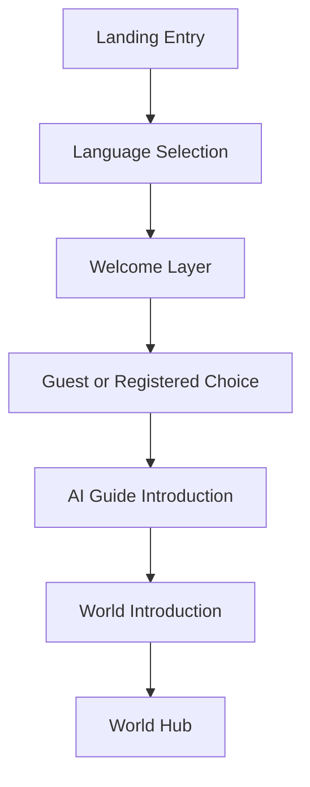
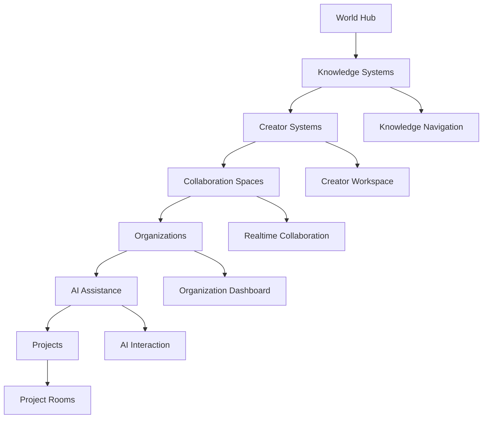
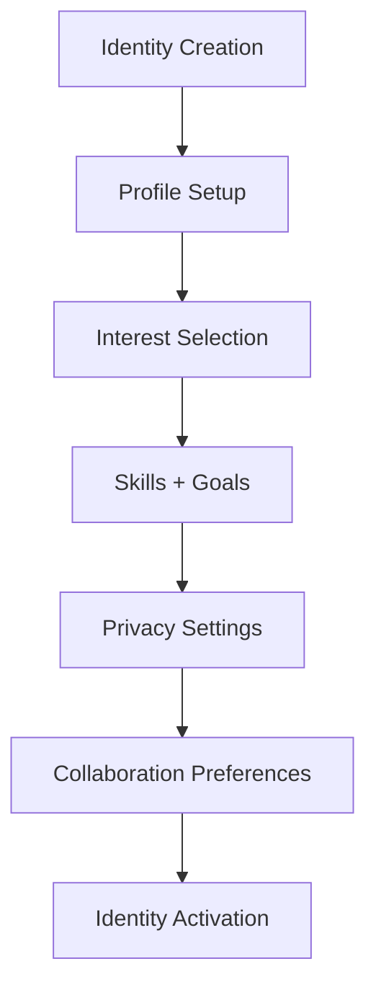
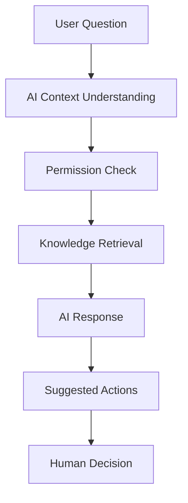
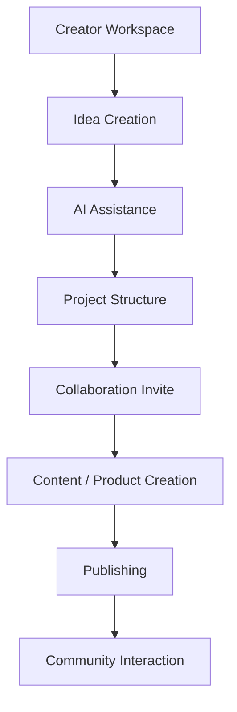
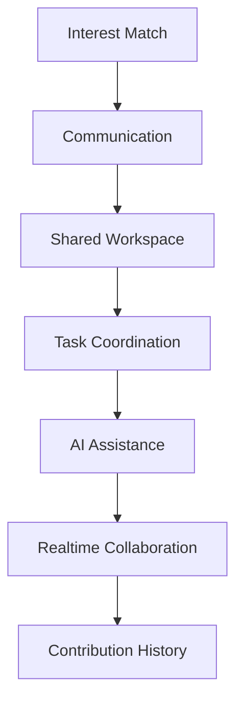
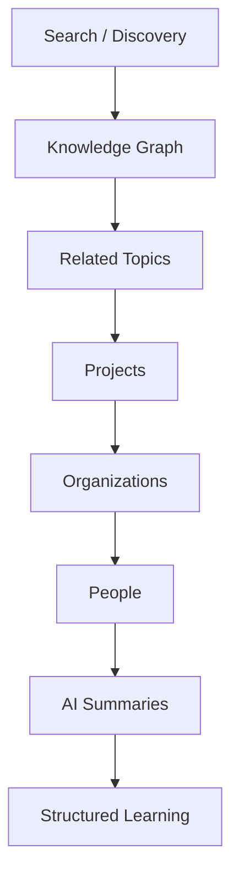

# ◉SYNTERRA UI/UX INTERACTION MAPS — PHASE 1

## Mērķis

Šis dokuments definē:

```text
SYNTERRA pirmās UI/UX
un lietotāja mijiedarbības kartes
```

Tas ir nākamais posms pēc:

- system topology,
- core flows,
- infrastructure mapping,
- un civilization architecture.

Šeit tiek modelēts:

```text
kā cilvēks praktiski kustas caur sistēmu
```

---

# 1. UI/UX Filosofijas Kodols

SYNTERRA UI nav:

- attention warfare,
- endless feed,
- notification addiction,
- vai engagement exploitation.

UI mērķis ir:

```text
palīdzēt cilvēkam orientēties
radīt
un sadarboties mierīgā vidē
```

---

# 2. First Contact Interaction Map



---

# 3. World Hub Interaction Map



---

# 4. Identity Interaction Flow



---

# 5. AI Guide Interaction Flow



---

# 6. Creator Workflow Map



---

# 7. Collaboration Interaction Map



---

# 8. Knowledge Navigation Map



---

# 9. Notification Philosophy

Notification systems jābūt:

- mierīgām,
- prioritizētām,
- kontekstuālām,
- neuzbāzīgām.

Svarīgais princips:

```text
notifications palīdz koordinācijai
nevis ekspluatē uzmanību
```

---

# 10. Mobile UX Direction

Mobile videi jābūt:

- intuitīvai,
- minimālai,
- skaidrai,
- koncentrētai uz movement flow.

Svarīgais princips:

```text
mazs ekrāns nedrīkst radīt lielu haosu
```

---

# 11. Desktop UX Direction

Desktop vide kļūst par:

```text
civilizācijas darba vidi
```

kur:

- creator systems,
- AI assistance,
- realtime collaboration,
- knowledge systems,
- organizations

var eksistēt vienlaikus.

---

# 12. Emotional UX Principle

UI/UX ietekmē:

- koncentrēšanos,
- psiholoģisko stabilitāti,
- sadarbību,
- uzticību,
- radošumu.

Tāpēc:

```text
SYNTERRA UX ir civilizācijas psiholoģiskā arhitektūra
```

---

# 13. Long-Term Direction

Ilgtermiņā UI/UX sistēma var kļūt par:

```text
intuitīvu cilvēku
AI
un zināšanu navigācijas vidi
```

kur cilvēki:

- neapmaldās,
- neizjūt troksni,
- un spēj sadarboties harmoniski.

---

# 14. Galvenais Noslēguma Princips

UI/UX mērķis nav:

- noturēt cilvēku pēc iespējas ilgāk,
- stimulēt atkarību,
- vai manipulēt uzmanību.

Mērķis ir:

```text
veidot mierīgu
cilvēkcentrētu
intuitīvu
un harmonisku civilizācijas vidi
```
