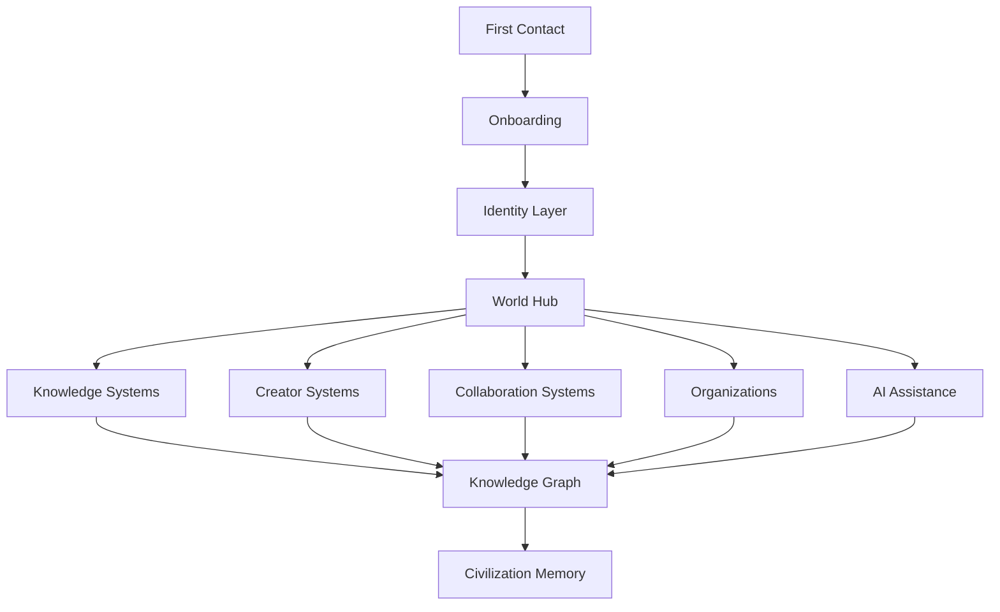
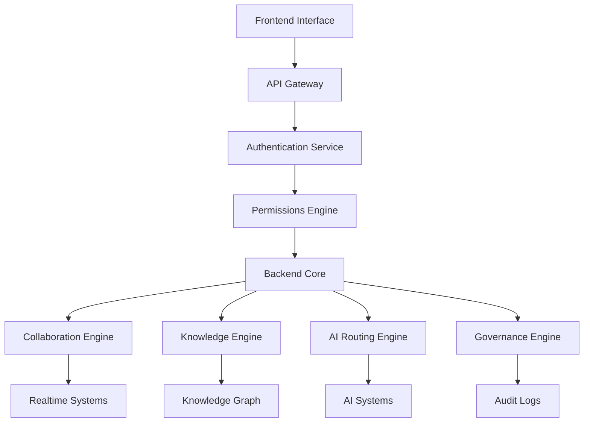
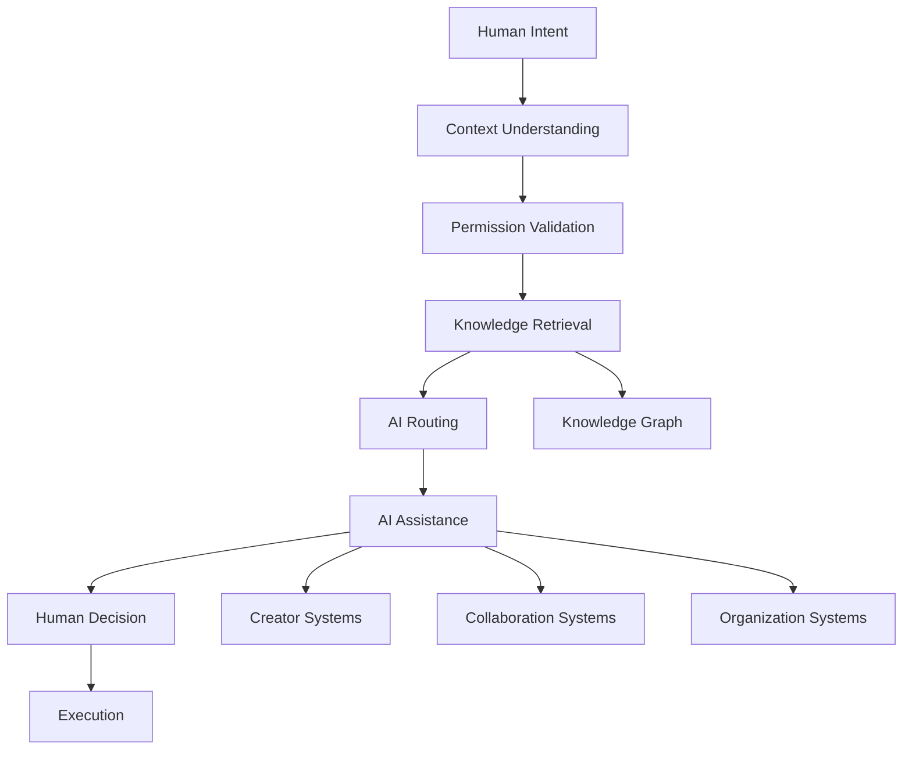
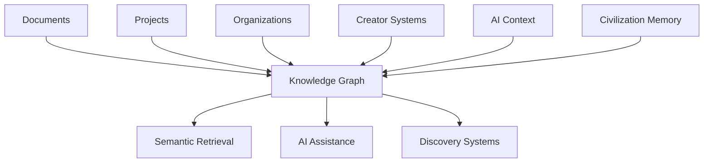
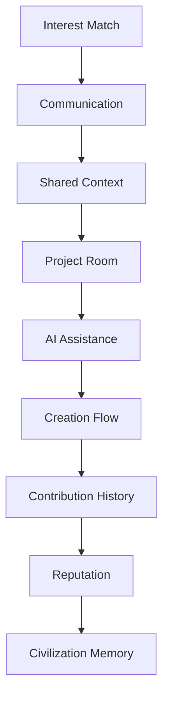
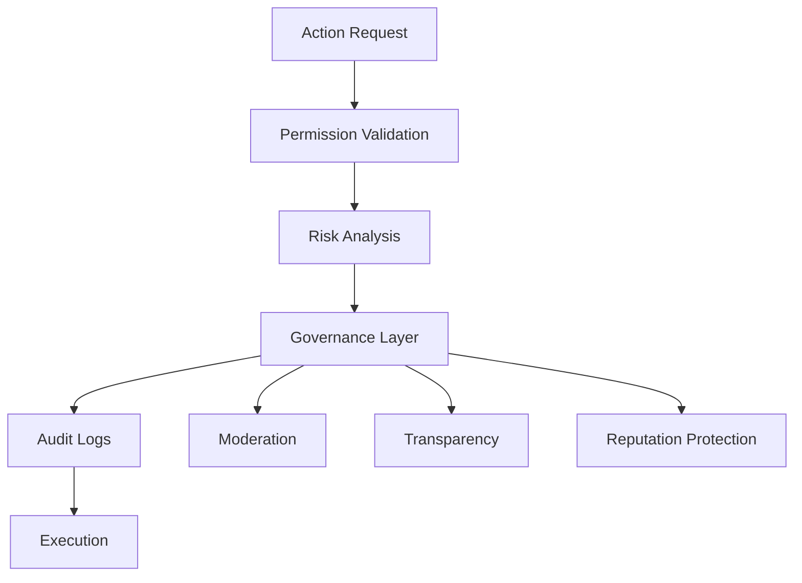
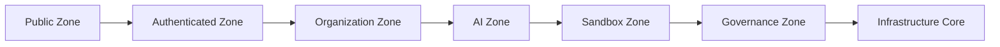
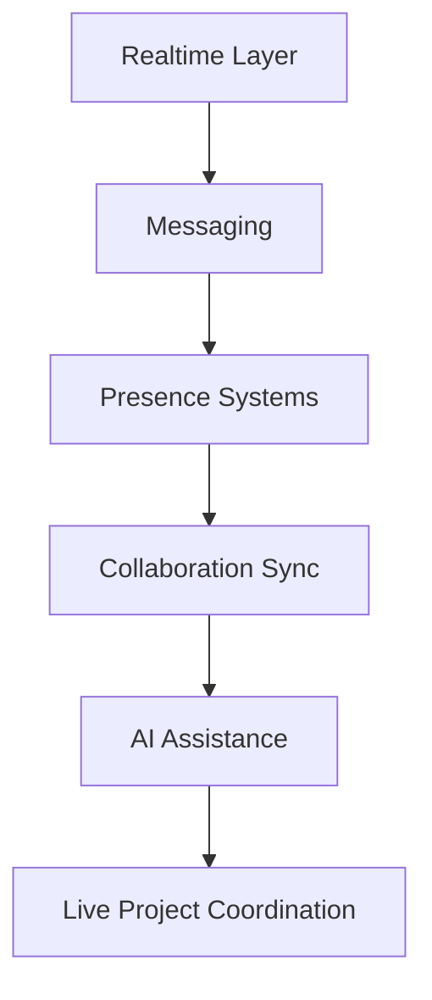

# ◉SYNTERRA VISUAL ARCHITECTURE DIAGRAMS — PHASE 1

## Mērķis

Šis dokuments sāk:

```text
SYNTERRA vizuālās sistēmu arhitektūras modelēšanu
```

Tas ir pirmais posms:

- system topology visualization,
- infrastructure relationship mapping,
- civilization systems modeling,
- AI routing visualization,
- un MVP skeleta diagrammu veidošanā.

---

# 1. CORE CIVILIZATION TOPOLOGY



---

# 2. FRONTEND → BACKEND TOPOLOGY



---

# 3. AI ROUTING FLOW



---

# 4. KNOWLEDGE GRAPH TOPOLOGY



---

# 5. COLLABORATION TOPOLOGY



---

# 6. GOVERNANCE FLOW



---

# 7. INFRASTRUCTURE ZONES



---

# 8. REALTIME INFRASTRUCTURE



---

# 9. MVP SKELETON — FIRST BUILDING BLOCKS

## Phase 1

```text
World Hub
Identity
Onboarding
Knowledge System
AI Guide
Basic Collaboration
```

---

## Phase 2

```text
Creator Systems
Realtime Collaboration
Organization Systems
Knowledge Graph
AI Routing
```

---

## Phase 3

```text
Advanced AI Infrastructure
Multi-Agent Systems
Civilization Governance
Decentralization Layers
```

---

# 10. Galvenais Secinājums

Tagad SYNTERRA:

```text
pāriet no tekstuālas arhitektūras
uz reālu sistēmu modelēšanu
```

Tas ir:

- architecture visualization,
- infrastructure engineering,
- civilization systems mapping,
- un pirmā MVP skeleta vizuālā modelēšana.
